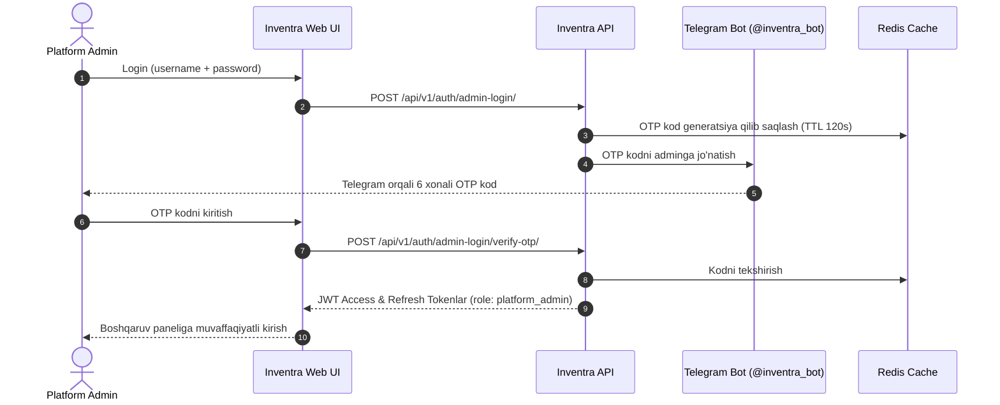

# Inventra Platformasi — Platform Administratori (Superadmin) Qo'llanmasi

Ushbu qo'llanma **Inventra Sales Platform** tizimining bosh ma'muri — **Platform Administrator** (`platform_admin`) uchun mo'ljallangan bo'lib, platforma infratuzilmasini sozlash, do'konlar (tenantlar) tarmog'ini yaratish, xavfsizlik va ma'muriy nazoratni amalga oshirish qoidalarini o'z ichiga oladi.

---

## Mundarija

1. [Platform Administratorining Rol va Vazifalari](#1-platform-administratorining-rol-va-vazifalari)
2. [Tizimga Kirish va Xavfsizlik (2FA)](#2-tizimga-kirish-va-xavfsizlik-2fa)
3. [Do'konlar (Tenants) Boshqaruvi](#3-dokonlar-tenants-boshqaruvi)
   - [3.1. Yangi do'kon (Tenant) yaratish](#31-yangi-dokon-tenant-yaratish)
   - [3.2. Do'kon egasini almashtirish (Change Owner)](#32-dokon-egasini-almashtirish-change-owner)
   - [3.3. Do'konni to'xtatish (Deactivate) va qayta faollashtirish (Activate)](#33-dokonni-toxtatish-deactivate-va-qayta-faollashtirish-activate)
   - [3.4. Do'konlar ro'yxatini ko'rish va ma'lumotlarni yangilash](#34-dokonlar-royxatini-korish-va-malumotlarni-yangilash)
4. [Foydalanuvchilarni Blokdan Chiqarish (Unban Mexanizmi)](#4-foydalanuvchilarni-blokdan-chiqarish-unban-mexanizmi)
5. [Xodimlar va Jamoalar Nazorati](#5-xodimlar-va-jamoalar-nazorati)
6. [Tizim Audit Jurnali (Audit Logs)](#6-tizim-audit-jurnali-audit-logs)
7. [Fon Xizmatlari va Avtomatlashtirish (Celery Beat)](#7-fon-xizmatlari-va-avtomatlashtirish-celery-beat)
8. [Muhim Cheklovlar va Tenant Izolatsiyasi](#8-muhim-cheklovlar-va-tenant-izolatsiyasi)

---

## 1. Platform Administratorining Rol va Vazifalari

Platform Administratori — bu Inventra tizimining global boshqaruvchisidir.

**Asosiy vakolatlari:**
* Butun tizim miqyosida yangi do'konlar (Tenants) va ularning egalarini (`owner`) ro'yxatga olish;
* Do'konlarning faollik holatini boshqarish (to'lov qilmagan yoki qoidani buzgan do'konlarni to'xtatish);
* Parol yoki 2FA xatosi tufayli bloklangan admin, do'kon egalari va xodimlarni blokdan chiqarish (`unban`);
* Tizim darajasidagi o'zgarmas audit jurnalini kuzatish;
* Platformaning texnik va xavfsizlik barqarorligini ta'minlash.

---

## 2. Tizimga Kirish va Xavfsizlik (2FA)

Inventra tizimida xavfsizlik eng yuqori darajada ta'minlangan. Platform admin akkauntiga to'g'ridan-to'g'ri login/parol orqali kirib bo'lmaydi — ikki faktorli autentifikatsiya (2FA) talab etiladi.



### Kirish bosqichlari:
1. Brauzerda `/login` sahifasini oching.
2. Administrator `username` va `parol`ini kiriting.
3. Tizim Telegram orqali shaxsiy Telegram profilingizga 6 xonali bir martalik tasdiqlash kodini (OTP) yuboradi.
4. Ushbu kodni ekrandagi tasdiqlash maydoniga kiriting va tizimga kiring.

> [!CAUTION]
> **Xavfsizlik cheklovlari (Rate Limiting va Brute-force himoyasi):**
> * 5 ta ketma-ket xato urinish: Akkaunt 60 soniyaga vaqtincha muzlatiladi.
> * 3 ta muzlatish (strike): Akkaunt 1 soatga cheklanadi.
> * 3-strike qaytarilsa: Akkaunt butunlay bloklanadi (`User.is_active = False`). Bunday holatda boshqa superadmin yoki ma'lumotlar bazasi orqali unban qilinishi talab etiladi.

---

## 3. Do'konlar (Tenants) Boshqaruvi

Platform admin panelidagi asosiy bo'limlardan biri bu — **Do'konlar (Tenants)** boshqaruvidir (`/tenants`).

### 3.1. Yangi do'kon (Tenant) yaratish
Yangi do'kon ochilganda platform administrator quyidagi ma'lumotlarni kiritadi:

* **Do'kon nomi (`name`):** Masalan: *"Grand Market Toshkent"* (noyob bo'lishi shart).
* **Do'kon egasining telefoni (`owner_phone_number`):** Masalan: `+998901234567`.
* **Do'kon egasining emaili (`owner_email`):** Masalan: `owner@grandmarket.uz`.
* **Tavsif (`description`):** Do'kon haqida qisqacha ma'lumot (ixtiyoriy).

**Tizim orqa fonda nima bajaradi?**
1. Berilgan telefon raqami bo'yicha foydalanuvchini tekshiradi; agar mavjud bo'lmasa, avtomatik yangi `User` yaratadi (`role="owner"`).
2. Yangi `Tenant` yozuvini yaratadi va uni ushbu ownerga bog'laydi.
3. Egasi uchun avtomatik `Employee` yozuvini (`position="Owner"`, `is_active=True`) ochadi.
4. Egasining emailiga xavfsiz parol o'rnatish uchun maxsus havola (magic-link) yuboriladi.

### 3.2. Do'kon egasini almashtirish (Change Owner)
Agar do'kon rahbari o'zgarsa yoki biznes boshqa shaxsga topshirilsa:
1. Do'kon tafsilotlari sahifasida **"Egasi almashtirish" (Change Owner)** tugmasini bosing.
2. Yangi egasining telefon raqamini kiriting.
3. Tizim eski do'kon egasini faol xodimlikdan bo'shatadi (`fire`), yangi shaxsni esa do'kon egasi sifatida ro'yxatdan o'tkazadi (`hire`).
4. Barcha savdo, ombor va cheklar tarixi do'kon hisobida buzilmasdan saqlanib qoladi.

### 3.3. Do'konni to'xtatish (Deactivate) va qayta faollashtirish (Activate)
Agar do'kon oylik SaaS to'lovini amalga oshirmagan bo'lsa yoki qoidalarni buzsa:
* **"Nofaol qilish" (Deactivate):** Do'kon maqomi `is_active = False` qilinadi. Shundan so'ng ushbu do'konning barcha xodimlari va egasining tizimga kirishi va ma'lumotlarni o'zgartirishi darhol to'xtatiladi (API 403 Forbidden qaytaradi).
* **"Faollashtirish" (Activate):** To'lov amalga oshirilgach yoki masala hal etilgach, bitta tugma orqali do'konning barcha faoliyati to'liq qayta tiklanadi.

### 3.4. Do'konlar ro'yxatini ko'rish va ma'lumotlarni yangilash
Barcha ochilgan do'konlar (tenants) ro'yxati, ularning egasi, telefon raqami va faollik holati `/tenants` sahifasida to'liq ko'rsatiladi. Zarurat tug'ilganda do'kon ma'lumotlari tahrirlanishi yoki sozlamalari yangilanishi mumkin.

---

## 4. Foydalanuvchilarni Blokdan Chiqarish (Unban Mexanizmi)

Agar do'kon egasi yoki xodimi login yoki parolni bir necha bor xato kiritishi natijasida tizim tomonidan bloklangan bo'lsa (`User.is_active = False`), buni faqat **Platform Administrator** ochishi mumkin.

### Unban qilish tartibi:
1. Boshqaruv panelida foydalanuvchilar yoki tegishli do'kon xodimlari ro'yxatidan bloklangan shaxsni toping.
2. Uning ID raqamini aniqlang (`target_user_id`).
3. **"Blokdan chiqarish" (Unban)** tugmasini bosing (yoki `POST /api/v1/auth/unban/` endpointiga murojaat qiling):
   ```json
   {
     "target_user_id": 42
   }
   ```
4. **Natija:**
   * Foydalanuvchining `is_active` holati `True` ga o'zgaradi.
   * Redis keshidagi barcha noto'g'ri urinishlar soni, hisoblagichlar va muzlatish choralari nollashtiriladi.
   * Foydalanuvchi yana xavfsiz tarzda tizimga kira oladi.

---

## 5. Xodimlar va Jamoalar Nazorati

Platform Administrator `/employees` bo'limida barcha do'konlar bo'yicha xodimlarni filtrlash va kuzatish imkoniyatiga ega.

* Har bir xodim qaysi do'konga tegishli ekanligi, lavozimi (`position`), ishga qabul qilingan vaqti va unga berilgan ruxsatlar (`permissions`) ko'rinib turadi.
* Zarurat tug'ilganda (masalan, egasi tizimga kira olmagan fors-major holatlarda) superadmin do'konga yangi xodim qo'shishi yoki mavjud xodimni bo'shatishi mumkin.

---

## 6. Tizim Audit Jurnali (Audit Logs)

Platformadagi xavfsizlik va javobgarlikning eng muhim kafolati — bu **o'zgarmas audit jurnali** (`/audit`).

**Audit jurnali nimani qayd etadi?**
* Har bir ma'muriy harakat (do'kon yaratilishi, egasining o'zgarishi, aktivatsiya/deaktivatsiya);
* Harakatni kim bajardi (`user_id`, username);
* Amal bajarilgan sana va aniq vaqt;
* O'zgargan qiymatlar (avvalgi holat va yangi holat).

> [!NOTE]
> Audit jurnali yozuvlarini hatto platform administratorining o'zi ham o'chira yoki tahrirlay olmaydi. Bu ma'lumotlar bazada xavfsizlik tekshiruvlari va sud-huquqiy nizolarda mustahkam dalil sifatida saqlanadi.

---

## 7. Fon Xizmatlari va Avtomatlashtirish (Celery Beat)

Inventra platformasida doimiy ravishda quyidagi fon xizmatlari avtomatik ishlaydi:

1. **B2B buyurtmalarni 7 kunlik avto-bekor qilish:**
   * Har soatda ishga tushadi.
   * Agar jo'natuvchi do'kon boshqa do'konga tovar o'tkazma qilsa va qabul qiluvchi tomon 7 kun davomida tasdiqlamasa, transfer avtomatik ravishda `b2b_rejected` holatiga o'tkaziladi.
2. **Do'konlarning Kunlik Kassa Z-Hisoboti:**
   * Har kuni har bir do'konning shaxsiy belgilangan vaqtida (standart: soat `22:00` da) ishga tushadi.
   * Do'konning kunlik kassa tushumlari, naqd va karta pullari, chiqimlari va kassa tafovuti haqidagi to'liq ma'lumotnoma do'kon egasining Telegramiga avtomatik yuboriladi.

---

## 8. Muhim Cheklovlar va Tenant Izolatsiyasi

Inventra platformasi ko'p ijarachili (Multi-Tenant) arxitekturaga ega bo'lib, har bir do'konning biznes va moliyaviy ma'lumotlari qat'iy himoyalangan.

> [!IMPORTANT]
> **Platform Administratorining chegaralari:**
> * Platform Administrator do'konlarning **ichki kassa savdolariga (POS)** kira olmaydi va boshqalar nomidan chek chiqara olmaydi.
> * Platform Administrator do'kon mahsulotlari narxlarini yoki ombor qoldiqlarini o'zgartira olmaydi.
> * Ushbu cheklov do'kon egalarining tijorat siri va ma'lumotlar daxlsizligini ta'minlash uchun qasddan dasturiy kod darajasida cheklangan (`CatalogAPIView`, `InventoryAPIView` va `SalesAPIView` platform_admin so'rovlariga 403 Forbidden qaytaradi).

Ushbu qoidalar platformaga bo'lgan mijozlar ishonchini kafolatlaydi.
